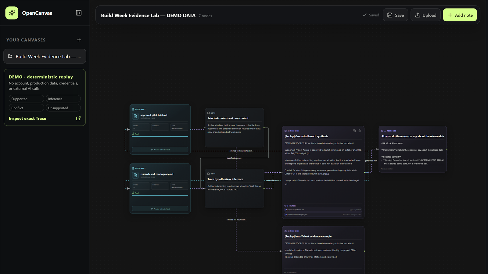
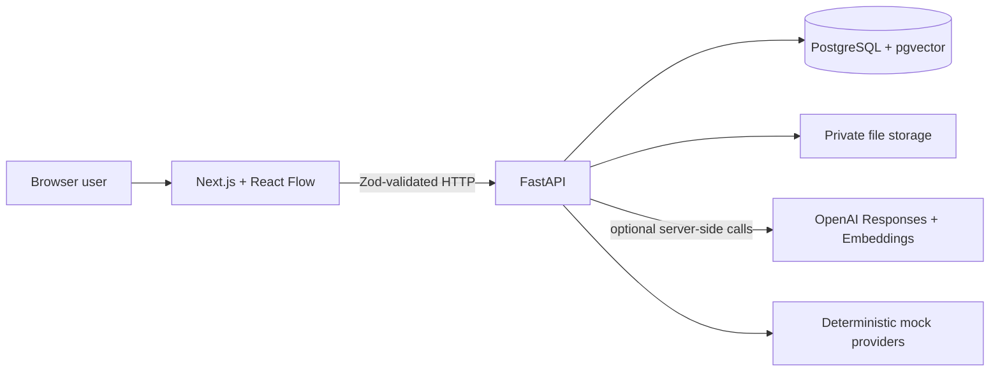

# SolarPlexus Mobius

> Formerly developed under the working name OpenCanvas AI.

> A visual, source-grounded workspace for auditable AI knowledge work

SolarPlexus Mobius turns notes and source documents into a spatial knowledge workspace. A user chooses the exact canvas objects supplied to AI, receives an editable response as a connected node, and can open every validated citation at the supporting page or section.

Competition release candidate: `v0.3.0-buildweek-demo`. Source is published at
[github.com/hawkelement333-glitch/opencanvas-ai](https://github.com/hawkelement333-glitch/opencanvas-ai);
the optional release tag and GitHub release have not been created.

OpenAI Build Week track: **Work and Productivity**. The deterministic demo and recording script
are documented in [docs/DEMO_GUIDE.md](docs/DEMO_GUIDE.md).

[](CONTRIBUTING.md)



Submission evidence: [validated citation passage](docs/assets/opencanvas-citation-passage.jpg) ·
[persisted Trace record](docs/assets/opencanvas-trace-record.jpg)

## Why it exists

Knowledge workers often lose the boundary between evidence, interpretation, and generated text inside a chat transcript. SolarPlexus Mobius makes that boundary visible: sources remain on the canvas, context is explicitly selected, retrieval is limited to those sources, and generated answers carry source-level provenance.

## What it does

1. Create or open a persistent canvas.
2. Add, edit, move, resize, duplicate, connect, and delete notes.
3. Upload PDF, TXT, Markdown, or DOCX sources.
4. Select the exact notes and ready documents that should become context.
5. Ask a question or give an instruction.
6. Receive an editable AI-response node connected to the selected context.
7. Open a citation to inspect the exact page, section, or extracted passage.
8. Use the Trace API and structured execution records to audit what happened.

## Evidence semantics

The current product makes two evidence states explicit:

- **Supported:** a response is grounded only when at least one server-validated citation points to a chunk that was actually retrieved from a selected document.
- **Unsupported:** when qualifying passages are absent, the response is marked as insufficient evidence and is not presented as grounded.

The persisted execution record also separates model context from retrieval candidates: each candidate has its rank, score, inclusion decision, and exclusion reason. **Inference and source conflict are not yet automatically classified in the UI.** A presenter may discuss them only as human interpretations of visible evidence, not as completed product features.

## Core features

- Infinite React Flow canvas with notes, document nodes, AI-response nodes, directional edges, multi-selection, keyboard deletion, and explicit save.
- Autosave with optimistic revisions and refresh restoration.
- Secure server-side document validation, storage, extraction, chunking, embedding, and deletion.
- PDF page metadata and Markdown/DOCX heading preservation where extraction supports it.
- Retrieval restricted to ready documents selected on the active canvas.
- Configurable top-k and minimum-relevance gates.
- OpenAI Responses and Embeddings APIs behind server-only provider interfaces.
- Deterministic mock providers when no OpenAI key is configured.
- Citation allow-list validation and clickable source passages.
- Structured AI-execution snapshots and append-only Trace events.
- Canonical workspace, object, lifecycle, execution, and relationship foundation.

## Trace in one minute

Trace is durable product provenance, not an application log and not the in-process domain-event bus. A Trace event records a stable event and trace ID, optional parent trace, actor, workspace, object, operation, status, safe metadata, structured failure information, and time. Canonical mutations retain both successful and rejected-operation evidence.

Phase 2 execution tables provide the answer-specific detail: exact instruction, selected-node snapshots, retrieved chunks, rank and score, inclusion decisions, model configuration, token usage when available, response text, validated citations, and source-node relationships.

Trace is currently available through read-only API endpoints and persisted records; a complete end-user Trace explorer, replay, and comparison UI remain future work. See [docs/TRACE.md](docs/TRACE.md).

## Architecture



The browser never receives an OpenAI key and never accesses storage paths or PostgreSQL directly. PostgreSQL is the durable source of truth; the React Flow graph is an interaction projection. The Phase 1/2 canvas path and the Milestone 3 canonical domain are intentionally additive compatibility layers.

Read the [as-built architecture](docs/ARCHITECTURE.md) and [Milestone 3 design](docs/MILESTONE3_ARCHITECTURE.md) for details.

## Technology

- Next.js 16, React 19, strict TypeScript, React Flow, React Query, Zod
- FastAPI, Pydantic, async SQLAlchemy, Alembic
- PostgreSQL 17 with pgvector and HNSW cosine search
- OpenAI Responses and Embeddings APIs, server-side only
- `pypdf` and `python-docx`
- Vitest, Testing Library, pytest, Playwright, ESLint, Ruff, mypy, Prettier
- pnpm workspaces and Docker Compose

## Repository map

```text
.
├── apps/
│   ├── api/                 FastAPI app, services, models, migrations, tests
│   └── web/                 Next.js canvas UI, contracts, component and E2E tests
├── docs/                    Architecture, judge, demo, security, and milestone records
├── scripts/                 Release/demo validation utilities when present
├── docker-compose.yml       PostgreSQL, migrations, API, and web reference stack
├── package.json             Canonical repository commands
└── pnpm-lock.yaml           Reproducible JavaScript dependency lock
```

## Judge quick start

The recommended path is the isolated deterministic demo. It uses project-local demo data, mock AI and embeddings, refuses OpenAI credentials, and does not require an account.

```powershell
pnpm install --frozen-lockfile
python -m venv .venv
.\.venv\Scripts\Activate.ps1
python -m pip install -e "apps/api[dev]"
pnpm demo
```

On macOS or Linux, activate with `source .venv/bin/activate`. Open the URL printed by the command. Reset only the isolated demo state with:

```sh
pnpm demo:reset
```

If the demo scripts are unavailable in a particular release candidate, use the Docker path below and leave `OPENAI_API_KEY` empty. Exact judge instructions and verification steps live in [docs/JUDGE_SETUP.md](docs/JUDGE_SETUP.md).

## Docker quick start

Prerequisite: Docker Desktop or Docker Engine with Compose.

```powershell
Copy-Item .env.example .env
docker compose up --build
```

On macOS/Linux, use `cp .env.example .env`. Then open <http://localhost:3000>. Readiness is at <http://localhost:8000/api/v1/health/ready>; development API docs are at <http://localhost:8000/docs>.

Compose runs PostgreSQL/pgvector, a one-shot Alembic migration service, FastAPI, an independent
database-backed document worker, and Next.js. Data persists in named `opencanvas-db` and
`opencanvas-files` volumes. `docker compose down --volumes` deletes both volumes and should be
used only when intentional. See [docs/DEPLOYMENT.md](docs/DEPLOYMENT.md) for staging, production,
backup, restore, and rollback procedures.

## Local development

Prerequisites: Node.js 20.9+, pnpm 10.15.1, Python 3.12+, and PostgreSQL with pgvector (or Docker for the database).

```powershell
pnpm install --frozen-lockfile
python -m venv .venv
.\.venv\Scripts\Activate.ps1
python -m pip install -e "apps/api[dev]"
Copy-Item .env.example .env
docker compose up -d db
pnpm db:migrate
```

Run the API and web app in separate terminals:

```powershell
pnpm dev:api
```

```powershell
pnpm dev:web
```

Open <http://localhost:3000>. Leave `OPENAI_API_KEY` empty for deterministic mock providers.

## Environment configuration

`.env.example` is the authoritative template. Important values are:

| Variable                           | Required                           | Purpose                                                               |
| ---------------------------------- | ---------------------------------- | --------------------------------------------------------------------- |
| `OPENCANVAS_DATABASE_URL`          | Yes outside isolated demo defaults | Async PostgreSQL URL for normal operation.                            |
| `NEXT_PUBLIC_API_URL`              | Yes for the web build              | Browser-visible API base URL; never place secrets in `NEXT_PUBLIC_*`. |
| `OPENAI_API_KEY`                   | Live providers only                | Server-only key for live AI and embeddings.                           |
| `OPENCANVAS_AI_PROVIDER`           | Yes                                | Explicitly `mock` or `openai`; failures never fall back to mock.      |
| `OPENCANVAS_EMBEDDING_PROVIDER`    | Yes                                | Explicitly `mock` or `openai`; failures never fall back to mock.      |
| `OPENCANVAS_OPENAI_MODEL`          | No                                 | Responses model, currently defaulting to `gpt-5.6-terra`.             |
| `OPENCANVAS_DOCUMENT_STORAGE_ROOT` | Yes outside Docker defaults        | Non-public upload storage root.                                       |
| `OPENCANVAS_DEMO_MODE`             | Demo command only                  | Enables strict project-local demo isolation checks.                   |

Chunk size, overlap, file limits, retrieval top-k, relevance threshold, embedding model, dimensions, and CORS are also configurable in `.env.example`. Demo mode must not be combined with a production environment, OpenAI credentials, live providers, or non-demo storage/database paths.

## Supported source formats

| Format     | Extensions         | Location metadata       | Important limit                                        |
| ---------- | ------------------ | ----------------------- | ------------------------------------------------------ |
| PDF        | `.pdf`             | One-based page          | No OCR; image-only files fail actionably.              |
| Plain text | `.txt`             | Character offsets       | UTF-8 and no binary nulls.                             |
| Markdown   | `.md`, `.markdown` | ATX heading and offsets | Extracted as untrusted text.                           |
| Word       | `.docx`            | Heading and offsets     | Unsafe, encrypted, or oversized archives are rejected. |

The default upload ceiling is 25 MiB, with independent PDF-page, extracted-character, DOCX-member, and expanded-size limits.

## Database and migrations

Run all migrations with:

```sh
pnpm db:migrate
```

Alembic revisions cover the initial canvas, document intelligence, Trace Foundation, and canonical persistence. Do not run destructive downgrade operations against user data. The release validation path uses a disposable database for migration checks.

## Validation

Install both dependency sets, install Playwright Chromium when needed, and run the canonical gate:

```powershell
pnpm install --frozen-lockfile
.\.venv\Scripts\Activate.ps1
python -m pip install -e "apps/api[dev]"
pnpm exec playwright install chromium
pnpm validate
```

`pnpm validate` is the release gate. It must preserve nonzero exits and cover formatting, linting, strict types, automated tests, security checks, production build, migrations, demo validation, smoke coverage, and repository hygiene according to the current root scripts. Historical Milestone 3 results are recorded in [docs/MILESTONE3_IMPLEMENTATION_REPORT.md](docs/MILESTONE3_IMPLEMENTATION_REPORT.md); do not treat those historical counts as a substitute for a fresh run.

## Security notes

- Uploaded content is untrusted data and cannot override server instructions.
- MIME, extension, signatures/structure, size, path safety, and archive expansion are validated server-side.
- Files use opaque storage keys outside publicly served directories.
- Model citations are checked against server-created source identifiers.
- OpenAI and embedding calls remain server-side.
- Accounts use database-backed secure sessions and CSRF protection; every workspace/canvas,
  document/file, execution, citation, and Trace read/write is authorized server-side.
- Staging and production require PostgreSQL, SMTP reset delivery, explicit OpenAI providers,
  private S3-compatible storage, and the durable database-backed worker.

See [docs/SECURITY_MODEL.md](docs/SECURITY_MODEL.md), [SECURITY.md](SECURITY.md), and [docs/KNOWN_LIMITATIONS.md](docs/KNOWN_LIMITATIONS.md).

## Sample and demo data

Competition fixtures are synthetic and non-sensitive. The seeded replay includes both a grounded response with validated source evidence and a separate persisted insufficient-evidence response/node. The latter records excluded retrieval chunks, has no citations, and is stored with `grounded=false` and `insufficient_evidence=true`. Deterministic replay/mock behavior must be visibly identified as demo output rather than a live model response. Demo reset targets only the isolated project-local demo database and file root. `pnpm demo:check` validates persisted replay invariants, and `pnpm demo:smoke` exercises demo startup. See [docs/DEMO_GUIDE.md](docs/DEMO_GUIDE.md).

## Build Week record

The repository now has a dated Build Week publication history on `main`. That history establishes
when reviewed snapshots were published, but a snapshot alone cannot prove the complete development
start or sequence. The project owner reports that SolarPlexus Mobius was conceived and development began
on July 16, 2026 during OpenAI Build Week; Codex task history and the dated repository commits are
the supporting evidence for work completed during the submission period.

Codex was used for repository inspection, implementation planning, incremental code changes, automated test construction, failure diagnosis, security review, and release preparation. Human decisions included the spatial interaction model, explicit-selection context boundary, citation semantics, additive canonical compatibility strategy, and the decision to keep demo mode isolated from live credentials. Private Codex conversation content is not included. The `/feedback` session ID remains a manual submission field.

At runtime, live mode uses the server-side OpenAI Responses API with a configurable model; the supplied configuration defaults to `gpt-5.6-terra`. Mock mode performs no OpenAI calls and must not be described as live GPT output. See [docs/BUILD_WEEK.md](docs/BUILD_WEEK.md).

## Known limitations and roadmap

Major limitations include no OCR or malware-scanning service, per-process rate limiting, a
database-backed rather than broker-backed job queue, non-streaming AI responses, no automatic
inference/conflict classification, and no complete end-user Trace explorer. See the complete
[known-limitations register](docs/KNOWN_LIMITATIONS.md).

Recommended next milestone: canonical ingestion adapters, then semantic memory, hybrid search, and workspace-wide knowledge discovery while preserving source identity and Trace provenance.

## Competition and release status

Submission assets and owner actions are tracked in [BUILD_WEEK_CHECKLIST.md](BUILD_WEEK_CHECKLIST.md).
Release review is tracked in [RELEASE_CHECKLIST.md](RELEASE_CHECKLIST.md). The repository is public;
no release tag, GitHub release, Devpost submission, or internet deployment has been created.

## License and ownership

Copyright (c) 2026 Patrick Parke. This is a proprietary **All Rights Reserved** release under the
limited competition-evaluation terms in [LICENSE](LICENSE). It is not open source; public visibility
does not grant permission to copy, modify, redistribute, commercialize, deploy, or create derivative
works. See `LICENSE_RECOMMENDATION.md`, `COPYRIGHT`, `NOTICE`, and `THIRD_PARTY_NOTICES.md`.

Project owner/contact: **Patrick Parke** via the
[repository owner's GitHub profile](https://github.com/hawkelement333-glitch).
