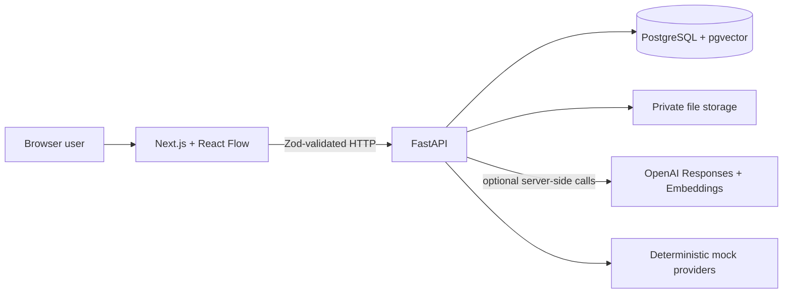

# SolarPlexus Mobius

> Formerly developed under the working name OpenCanvas AI.

> **A visual, source-grounded workspace for auditable AI knowledge work.**

SolarPlexus Mobius turns notes and source documents into a spatial knowledge workspace. Users choose
the exact canvas objects supplied to AI, receive an editable response as a connected node, and can
open every validated citation at the supporting page, section, or extracted passage.

This repository contains the OpenAI Build Week competition release candidate
`v0.3.0-buildweek-demo` for the **Work and Productivity** track.

- Source repository: <https://github.com/hawkelement333-glitch/opencanvas-ai>
- Project website: <https://solarplexus-mobius.hawkelement333.chatgpt.site> — product overview only;
  no public demo or hosted application is currently available
- Public demo video: <https://www.youtube.com/watch?v=gd0JWNcHhAA>
- Judge setup: [docs/JUDGE_SETUP.md](docs/JUDGE_SETUP.md)
- Recording guide: [docs/DEMO_GUIDE.md](docs/DEMO_GUIDE.md)
- Build Week record: [docs/BUILD_WEEK.md](docs/BUILD_WEEK.md)

The repository, package, module, environment-variable, database, and storage identifiers retain the
`opencanvas` working name for compatibility. Public product branding is **SolarPlexus Mobius**.

[](CONTRIBUTING.md)


Submission evidence: [validated citation passage](docs/assets/opencanvas-citation-passage.jpg) ·
[persisted Trace record](docs/assets/opencanvas-trace-record.jpg)

## Why it exists

Knowledge workers often lose the boundary between evidence, interpretation, and generated text
inside a chat transcript. SolarPlexus Mobius makes that boundary visible: sources remain on the
canvas, context is explicitly selected, retrieval is limited to those sources, and generated answers
carry source-level provenance.

## What it does

1. Create or open a persistent canvas.
2. Add, edit, move, resize, duplicate, connect, and delete notes.
3. Upload PDF, TXT, Markdown, or DOCX sources.
4. Select the exact notes and ready documents that should become AI context.
5. Ask a question or provide an instruction.
6. Receive an editable AI-response node connected to the selected context.
7. Open a citation at the exact page, section, or extracted passage.
8. Inspect structured execution and Trace evidence.

## Evidence semantics

The current product makes two evidence states explicit:

- **Supported:** a response is grounded only when at least one server-validated citation points to a
  chunk that was actually retrieved from a selected document.
- **Unsupported:** when qualifying passages are absent, the response is marked as insufficient
  evidence and is not presented as grounded.

The persisted execution record separates model context from retrieval candidates. Each candidate
retains its rank, score, inclusion decision, and exclusion reason.

**Inference and source conflict are not automatically classified in the current UI.** They may be
discussed only as human interpretations of visible evidence, not as completed product features.

## Core features

- Infinite React Flow canvas with notes, document nodes, AI-response nodes, directional edges,
  multi-selection, keyboard deletion, and explicit save
- Autosave with optimistic revisions and refresh restoration
- Secure server-side document validation, storage, extraction, chunking, embedding, and deletion
- PDF page metadata and Markdown/DOCX heading preservation where extraction supports it
- Retrieval restricted to ready documents selected on the active canvas
- Configurable top-k and minimum-relevance gates
- OpenAI Responses and Embeddings APIs behind server-only provider interfaces
- Deterministic mock providers when no OpenAI key is configured
- Citation allow-list validation and clickable source passages
- Structured AI-execution snapshots and append-only Trace events
- Canonical workspace, object, lifecycle, execution, and relationship foundation

## Trace in one minute

Trace is durable product provenance, not an application log or the in-process domain-event bus. A
Trace event records a stable event and trace ID, optional parent trace, actor, workspace, object,
operation, status, safe metadata, structured failure information, and time. Canonical mutations
retain evidence for successful and rejected operations.

Execution tables provide answer-specific detail: the exact instruction, selected-node snapshots,
retrieved chunks, ranks and scores, inclusion decisions, model configuration, token usage when
available, response text, validated citations, and source-node relationships.

Trace is currently available through persisted records, prepared demo evidence, and read-only API
endpoints. A complete end-user Trace explorer, replay interface, and comparison UI remain future
work. See [docs/TRACE.md](docs/TRACE.md).

## Architecture



The browser never receives an OpenAI key and never accesses storage paths or PostgreSQL directly.
PostgreSQL is the durable source of truth; the React Flow graph is an interaction projection. The
Phase 1/2 canvas path and Milestone 3 canonical domain remain additive compatibility layers.

Read the [as-built architecture](docs/ARCHITECTURE.md) and
[Milestone 3 design](docs/MILESTONE3_ARCHITECTURE.md) for details.

## Technology

- Next.js 16, React 19, strict TypeScript, React Flow, React Query, Zod
- FastAPI, Pydantic, async SQLAlchemy, Alembic
- PostgreSQL 17 with pgvector and HNSW cosine search
- OpenAI Responses and Embeddings APIs, server-side only
- `pypdf` and `python-docx`
- Vitest, Testing Library, pytest, Playwright, ESLint, Ruff, mypy, Prettier
- pnpm workspaces and Docker Compose

## Judge quick start

The recommended judging path is the isolated deterministic demo. It uses project-local synthetic
data, deterministic mock AI and embeddings, refuses OpenAI credentials, and does not require an
account or paid API usage.

### Requirements

- Git
- Node.js 20.9 or newer
- pnpm 10.15.1
- Python 3.12 or newer

### Windows PowerShell

```powershell
git clone https://github.com/hawkelement333-glitch/opencanvas-ai.git
Set-Location opencanvas-ai
pnpm install --frozen-lockfile
python -m venv .venv
.\.venv\Scripts\Activate.ps1
python -m pip install -e "apps/api[dev]"
pnpm demo
```

### macOS or Linux

```sh
git clone https://github.com/hawkelement333-glitch/opencanvas-ai.git
cd opencanvas-ai
pnpm install --frozen-lockfile
python3 -m venv .venv
source .venv/bin/activate
python -m pip install -e "apps/api[dev]"
pnpm demo
```

Open the URL printed by the command, normally <http://localhost:3000>.

Reset only the isolated demo state with:

```sh
pnpm demo:reset
```

Exact judge instructions and verification steps are in
[docs/JUDGE_SETUP.md](docs/JUDGE_SETUP.md).

## Docker quick start

Prerequisite: Docker Desktop or Docker Engine with Compose.

```powershell
Copy-Item .env.example .env
docker compose up --build
```

On macOS/Linux, use `cp .env.example .env`. Then open <http://localhost:3000>. Readiness is at
<http://localhost:8000/api/v1/health/ready>; development API documentation is at
<http://localhost:8000/docs>.

Compose runs PostgreSQL/pgvector, a one-shot Alembic migration service, FastAPI, and Next.js. Data
persists in named `opencanvas-db` and `opencanvas-files` volumes. `docker compose down --volumes`
deletes both volumes and should be used only intentionally.

## Live OpenAI mode

The application implements a server-side OpenAI Responses API provider and a server-side OpenAI
Embeddings provider. The checked-in Responses configuration defaults to `gpt-5.6-terra`, while model
selection remains environment-configurable.

The competition demonstration deliberately uses deterministic mock providers. It makes no live
OpenAI calls and must not be described as live GPT-5.6 output.

OpenAI credentials are optional for normal local development and are rejected by strict demo mode.
Never place secrets in `NEXT_PUBLIC_*` variables.

## How Codex was used

Codex served as an engineering collaborator for:

- repository and architecture inspection
- implementation planning and milestone sequencing
- backend, frontend, persistence, migration, and provider implementation
- automated unit, integration, browser, migration, and security-focused tests
- failure diagnosis and iteration
- security, release, documentation, and competition-readiness audits

Human-directed product and architecture decisions included the spatial interaction model, explicit
node selection as the context boundary, selected-source retrieval, server-validated citation
semantics, insufficient-evidence behavior, additive canonical compatibility strategy, separation of
Trace from ordinary logs, and strict isolation of demo data from live credentials.

The approved Codex `/feedback` Session ID is entered directly in Devpost. Private Codex conversation
content is not published in this repository.

## How GPT-5.6 was used

The project owner used GPT-5.6 through ChatGPT during product development to:

- refine the product scope, evidence semantics, and judge-facing explanations
- review architecture, provenance, retrieval, and user-experience decisions
- identify edge cases, risks, and release-readiness concerns
- turn implementation results into clear documentation and demo narration

This development use is separate from the recorded competition runtime. The deterministic demo uses
mock answer and embedding providers so judges can reproduce the same workflow without API credentials
or paid usage. The optional live provider remains separate and defaults to `gpt-5.6-terra` when enabled.

## Validation

Install the dependency sets, install Playwright Chromium when needed, and run the canonical release
gate:

```powershell
pnpm install --frozen-lockfile
.\.venv\Scripts\Activate.ps1
python -m pip install -e "apps/api[dev]"
pnpm exec playwright install chromium
pnpm validate
```

Additional final checks:

```powershell
pnpm validate:clean-clone
pnpm demo:check
pnpm demo:smoke
```

`pnpm validate` preserves nonzero exits and covers formatting, linting, strict types, automated tests,
security checks, production build, migrations, demo validation, smoke coverage, and repository
hygiene according to the current root scripts. Historical test counts are not a substitute for a
fresh run against the final candidate.

## Security notes

- Uploaded content is untrusted data and cannot override server instructions.
- MIME, extension, signatures/structure, size, path safety, and archive expansion are validated
  server-side.
- Files use opaque storage keys outside publicly served directories.
- Model citations are checked against server-created source identifiers.
- OpenAI and embedding calls remain server-side.
- The current application has no authentication or multi-tenant authorization and is suitable only
  for trusted single-user/local use.

See [docs/SECURITY_MODEL.md](docs/SECURITY_MODEL.md), [SECURITY.md](SECURITY.md), and
[docs/KNOWN_LIMITATIONS.md](docs/KNOWN_LIMITATIONS.md).

## Supported source formats

| Format     | Extensions         | Location metadata       | Important limit                                        |
| ---------- | ------------------ | ----------------------- | ------------------------------------------------------ |
| PDF        | `.pdf`             | One-based page          | No OCR; image-only files fail actionably.              |
| Plain text | `.txt`             | Character offsets       | UTF-8 and no binary nulls.                             |
| Markdown   | `.md`, `.markdown` | ATX heading and offsets | Extracted as untrusted text.                           |
| Word       | `.docx`            | Heading and offsets     | Unsafe, encrypted, or oversized archives are rejected. |

The default upload ceiling is 25 MiB, with independent PDF-page, extracted-character, DOCX-member,
and expanded-size limits.

## Demo and visual-asset integrity

Competition fixtures are synthetic and non-sensitive. The seeded replay includes a grounded response
with validated evidence and a separate insufficient-evidence response with no citations. The
interface identifies deterministic replay/mock behavior as demo output.

The Devpost promotional thumbnail is branding artwork, not evidence of functionality. Product
screenshots and video demonstrations must be real captures from the reviewed localhost build. Do not
present generated interface concepts as completed features.

See [docs/DEMO_GUIDE.md](docs/DEMO_GUIDE.md) for the exact recording and visual-integrity rules.

## Known limitations and roadmap

Major limitations include no authentication, no OCR, no durable distributed ingestion worker,
per-process rate limiting, local file storage, non-streaming AI responses, no automatic
inference/conflict classification, and no complete end-user Trace explorer.

Recommended next work includes canonical ingestion adapters, semantic memory, hybrid search,
workspace-wide knowledge discovery, richer Trace inspection/replay/comparison, collaboration,
security hardening, scalability, and a hosted public release.

## Competition status

The repository is public, the documented judging path is the deterministic localhost demo, and the
public submission video is <https://www.youtube.com/watch?v=gd0JWNcHhAA>. The approved Codex
`/feedback` Session ID must still be entered directly in Devpost.

Before submission, open the repository and video in an incognito browser and confirm that the video is
public, under three minutes, audible, and accurately distinguishes deterministic mock replay from live
GPT-5.6 integration.

Submission actions are tracked in [BUILD_WEEK_CHECKLIST.md](BUILD_WEEK_CHECKLIST.md), and release
review is tracked in [RELEASE_CHECKLIST.md](RELEASE_CHECKLIST.md).

## License and ownership

Copyright (c) 2026 Patrick Parke. This is a proprietary **All Rights Reserved** release under the
limited competition-evaluation terms in [LICENSE](LICENSE). It is not open source; public visibility
does not grant permission to copy, modify, redistribute, commercialize, deploy, or create derivative
works.

See `LICENSE_RECOMMENDATION.md`, `COPYRIGHT`, `NOTICE`, and `THIRD_PARTY_NOTICES.md`.

Project owner/contact: **Patrick Parke** through the
[repository owner's GitHub profile](https://github.com/hawkelement333-glitch).
