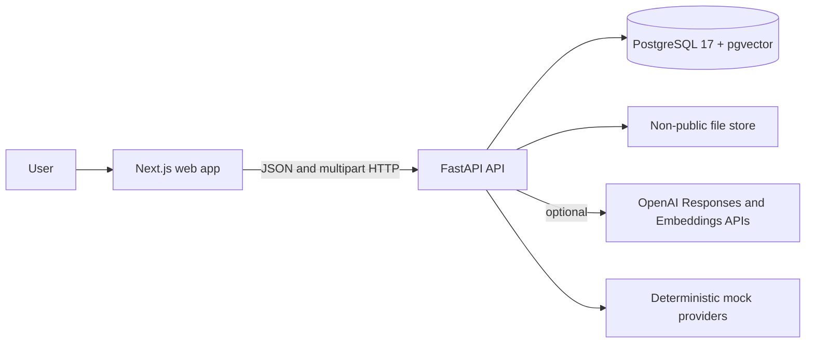
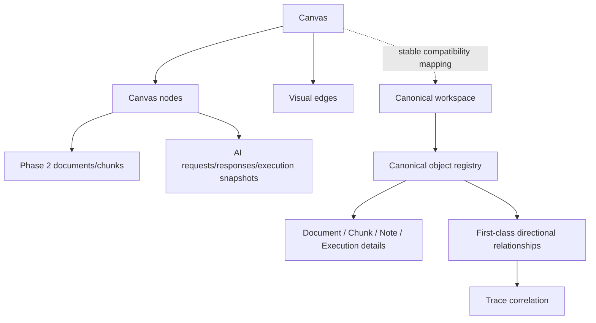
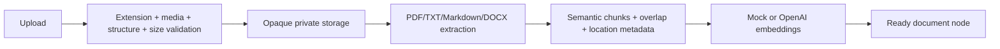

# OpenCanvas AI as-built architecture

This document describes the competition release candidate as implemented. Milestone-specific decisions remain in `MVP_ARCHITECTURE.md`, `PHASE2_ARCHITECTURE.md`, and `MILESTONE3_ARCHITECTURE.md`.

## System context

The browser is an untrusted client. It renders spatial state and sends validated commands, but the API reloads selected objects, scopes retrieval, creates source identifiers, calls providers, validates citations, and persists results.

## Runtime components

### Web

- Next.js App Router and React 19 provide the application shell.
- React Flow renders notes, document references, AI responses, directional visual edges, minimap, controls, selection, drag, and resize interactions.
- React Query loads canvas lists and snapshots and polls document status.
- Component state and a serialized autosave queue apply optimistic edits while the API remains durable truth.
- Zod validates inputs before requests and validates every successful response before it enters UI state.
- The current AI request is a normal JSON request, not SSE streaming.

### API

- FastAPI routers expose health, canvas, document, Trace, and canonical endpoints below `/api/v1`.
- Pydantic models reject malformed inputs and bound strings, collections, and numeric settings.
- Async SQLAlchemy sessions provide request-scoped persistence.
- Provider protocols isolate live OpenAI calls from deterministic mock answer and embedding implementations.
- Document services separate validation, opaque storage, extraction, chunking, processing, embeddings, and retrieval.
- Canonical services separate lifecycle/domain rules, persistence repositories, transient domain events, and durable Trace.

### Data and storage

- PostgreSQL stores canvases, nodes, visual edges, document metadata, extracted chunks, embeddings, citations, AI executions, Trace events, and canonical records.
- pgvector stores 1,536-dimensional document embeddings and provides HNSW cosine search in PostgreSQL.
- Uploaded bytes live below a configured API-only root under opaque document/file keys; internal paths are never API output.
- Docker Compose uses separate named volumes for database and uploaded files.

## Two compatible domain layers

Milestone 3 is additive. It does not silently rewrite the working Phase 1/2 model.

Legacy visual edges express canvas layout context. Canonical relationships are independent semantic domain objects with controlled types and mandatory Trace correlation. Existing canvas notes and documents are not automatically converted into canonical objects beyond the workspace compatibility mapping.

## Main persistence groups

| Group                 | Representative records                                                                             | Purpose                                                                          |
| --------------------- | -------------------------------------------------------------------------------------------------- | -------------------------------------------------------------------------------- |
| Canvas                | `canvases`, `canvas_nodes`, `edges`                                                                | Spatial state, revisions, selection targets, visual connections.                 |
| Document intelligence | `documents`, `document_files`, `document_chunks`, `document_embeddings`, processing jobs           | Source metadata, bytes reference, extraction, chunks, vectors, processing state. |
| Grounded answers      | AI requests/responses, citations, response sources, execution node/chunk/citation/source snapshots | Reproducible context and answer evidence.                                        |
| Trace                 | `trace_events`                                                                                     | Append-only operation events and structured outcomes.                            |
| Canonical knowledge   | workspaces, canonical objects and typed details, canonical relationships                           | Stable identity, lifecycle, versioning, graph semantics.                         |

The exact model and deletion behavior are documented in `PHASE2_ARCHITECTURE.md` and `MILESTONE3_ARCHITECTURE.md`.

## Canvas persistence flow

1. The app lists canvases and loads one server snapshot.
2. React Flow projects persisted nodes and edges into interactive objects.
3. Content and geometry changes enter a serialized autosave queue.
4. Each mutation includes the current revision.
5. The API rejects stale revisions with `409` instead of silently overwriting data.
6. Refresh reconstructs the graph from the database snapshot.

## Document pipeline

Observable processing states are uploading, extracting, chunking, embedding, ready, and failed. In-process background processing uses a fresh database session; startup reconciliation makes interrupted work retryable. It is not a distributed job queue.

## Grounded answer flow

1. The client submits an instruction and selected node IDs.
2. The API reloads selected nodes from the canvas and snapshots their current versions/content.
3. Notes are budgeted as explicit context. Only selected, ready document IDs are eligible for retrieval.
4. Query embeddings retrieve ranked chunks, and the configured relevance threshold determines inclusion.
5. Source blocks are delimited as untrusted data with server-created stable source IDs.
6. The provider is instructed not to follow source-embedded instructions and to return citations or insufficient evidence.
7. The API rejects citations not present in the retrieved allow-list and rejects an allegedly grounded answer with no valid citation.
8. One transaction creates the AI node, response, citation/source records, generated edges, and execution evidence.
9. Citation clicks fetch the exact source passage and open the document preview at its page, heading, or offsets.

Mock mode is deterministic and makes no external OpenAI call. It is a development/demo mechanism, not a semantic-quality benchmark.

## Trace and execution provenance

Trace events record operation-level chronology and outcome. AI execution records capture the answer-specific context necessary for later inspection:

- exact instruction and selected-node order;
- node IDs, revisions, titles, types, and content snapshots;
- candidate chunk IDs, document IDs, rank, score, inclusion, and exclusion reason;
- provider/model and model/retrieval configuration snapshots;
- generated text and provider response ID;
- validated citation order and immutable source-location snapshots;
- response-to-source-node associations and token usage when available.

Live source records can be deleted while selected immutable execution snapshots remain for audit. Trace has read APIs but no complete end-user explorer yet.

## Canonical lifecycle and relationships

Canonical records use stable UUIDs, workspace ownership, timestamps, metadata, deterministic versions, and `created`, `active`, `archived`, or terminal `deleted` lifecycle state. Archived records reject normal updates until reactivated; deleted records are hidden by default.

Relationships are directional, same-workspace objects. The current controlled vocabulary is `contains`, `part_of`, `references`, `derived_from`, and `related_to`. The relationship itself has lifecycle and Trace evidence. A live endpoint cannot be deleted until its relationships are removed through traced mutations.

## Security boundaries

- OpenAI credentials and calls are server-only.
- CORS uses an explicit origin list and no credentialed wildcard.
- SQLAlchemy parameterizes application queries.
- Upload validation does not trust client MIME or filenames.
- DOCX archive traversal, encrypted archives, member count, and expansion size are bounded.
- Extracted content is rendered as text and treated as untrusted prompt data.
- Document retrieval is limited to selected documents on the active canvas.
- Demo mode enforces isolated paths, mock providers, and absence of OpenAI credentials.

There is no authentication or multi-user authorization. Workspace scoping is a domain invariant, not an access-control boundary.

## Deployment

The reference Compose topology is:

- `db`: `pgvector/pgvector:pg17` with health check;
- `api-migrate`: one-shot Alembic upgrade;
- `api`: non-root FastAPI container with a private file volume;
- `web`: non-root Next.js standalone container.

Production hardening still requires authentication, managed secrets, TLS/reverse proxy, malware scanning, object storage, centralized rate limiting, durable job/outbox infrastructure, backups, monitoring, and retention policy.

## Architecture decisions

1. **Explicit selection controls AI context.** Retrieval cannot silently search unselected documents.
2. **Server validates grounding.** The model cannot authorize its own citation IDs.
3. **PostgreSQL is durable truth.** React Flow is a projection, not a database.
4. **Mock and live providers share interfaces.** Tests and demos remain deterministic without weakening live configuration.
5. **Trace and execution evidence are separate.** Chronological operations and full answer context have different query needs.
6. **Canonical migration is additive.** Stable future semantics do not risk existing canvas behavior.
7. **Optimistic revisions reject silent loss.** Concurrent writes conflict rather than merge.

## Deferred architecture

Authentication, real-time collaboration, OCR, distributed processing, object storage, automatic inference/conflict classification, Trace explorer/replay, canonical ingestion adapters, hybrid workspace search, and semantic memory remain deferred. See `KNOWN_LIMITATIONS.md`.
