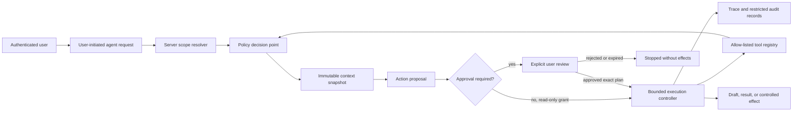
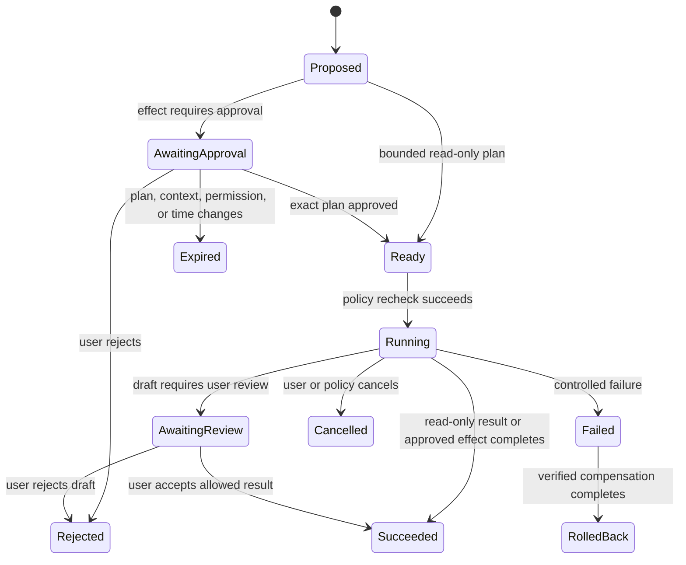

# Milestone 4 Controlled Agent Architecture

Status: Milestone 4.0 planning contract. No active agent runtime is implemented by this document.

## 1. Purpose and boundary

Milestone 4 introduces controlled agents only through staged, testable implementation phases. This
4.0 checkpoint defines the architecture and safety contract before any agent can run, call a tool,
write data, enqueue work, schedule work, or contact a provider.

The deterministic competition demonstration remains an immutable product artifact. Milestone 4
must build beside it, never through it. `APP_MODE=demo` continues to use the existing seeded data,
deterministic providers, inline document processing, stable identifiers, and no external AI calls.

Milestone 4.0 makes documentation changes only. It does not add:

- agent database tables or migrations;
- agent API routes, providers, tools, workers, queues, or schedulers;
- background or autonomous execution;
- recursive delegation or decision loops;
- new external AI or embedding calls;
- new production services or deployment dependencies;
- changes to canvas behavior or the deterministic demo.

## 2. Existing foundations to preserve

Controlled agents must reuse, not bypass, the productization foundation:

- authenticated users and server-enforced workspace ownership;
- canvas, document, canonical object, and Trace authorization boundaries;
- explicit deterministic and live provider selection with fail-closed configuration;
- selected-context retrieval and server-validated citations;
- AI execution context snapshots, source versions, usage records, and cost limits;
- append-only Trace events with safe structured errors;
- optimistic revisions for current mutable objects;
- private file storage and authorized file access;
- rate, request, context, retrieval, output, retry, and token-budget limits.

The existing `DocumentProcessingJob`, `DocumentWorker`, and worker heartbeat are document-ingestion
infrastructure. They are not an agent queue, agent executor, or general task runner. Future agent
work must not be hidden inside or dispatched through those types.

The living-universe labels introduced in Milestone 3.75 are semantic presentation. A star, planet,
moon, pathway, or other visual node does not gain runtime authority by being rendered. Visual role
and execution role remain independent fields with independent authorization.

## 3. Design principles

1. **User initiation, not ambient autonomy.** Every execution begins with a deliberate user action
   against a visible scope. Page load, selection change, document upload, or elapsed time cannot
   silently start an agent.
2. **Deny by default.** An agent has no implicit access. The server mints a narrow capability grant
   for a specific user, workspace, context snapshot, action set, budget, and lifetime.
3. **Plan before effect.** The system separates proposal generation from effectful execution. A
   user can inspect the exact intended actions before approval.
4. **Approval is bound, not conversationally inferred.** Approval covers a hashed plan, effective
   permissions, target versions, tools, budget ceiling, and expiry. Changed inputs invalidate it.
5. **Server policy is authoritative.** Model output, uploaded content, UI state, and client-supplied
   identifiers can request actions but cannot grant permission.
6. **No privilege amplification.** Delegation, retries, and child work can only narrow the parent
   grant. They cannot add workspaces, resources, tools, budget, or duration.
7. **Trace or fail.** An effect is not considered authorized or complete unless the decision,
   attempt, result, and safe error state are durably auditable.
8. **Bounded execution.** Calls, tokens, elapsed time, writes, output size, retries, and child depth
   have hard server-side ceilings.
9. **Human-reviewable output.** Agent output remains a draft or proposal until the user accepts it
   where acceptance changes durable product state.
10. **Demo isolation is structural.** Demo mode cannot enable live agent providers, persistent agent
    jobs, external tools, schedules, or production data access.

## 4. Conceptual control plane

The diagram is a target architecture, not an implementation in Milestone 4.0.

### 4.1 Control-plane components

- **Scope resolver:** reloads user, workspace, canvas, object, document, and source identities from
  the database and rejects foreign or deleted targets.
- **Policy decision point:** evaluates the requested role, capability, target, context, budget,
  approval, environment, and current object versions. It returns allow, deny, or approval-required.
- **Policy enforcement point:** wraps every provider and tool boundary. A plan cannot call adapters
  directly.
- **Context snapshotter:** records the exact selected nodes, document versions, chunks, exclusions,
  source locations, and policy version used to produce a plan.
- **Proposal builder:** produces a structured, bounded action plan. Free-form prose is never an
  executable plan.
- **Approval service:** stores user decisions bound to an immutable plan hash and expiration.
- **Execution controller:** applies call, time, token, write, retry, and cancellation limits; it
  cannot invent new actions after approval.
- **Tool registry:** contains explicit server-owned adapters with schemas, risk classes, required
  capabilities, idempotency behavior, and redaction rules.
- **Trace/audit writer:** persists user-visible provenance and restricted operational audit data.
- **Budget and cancellation controller:** enforces ceilings before and during execution and exposes
  a user stop control.

## 5. Agent role taxonomy

Role describes intended responsibility. Scope describes data authority. Capability grants describe
actual permission. A role name alone grants nothing.

| Role                       | Living-universe scope        | Intended future responsibility                             | Maximum default authority                                     |
| -------------------------- | ---------------------------- | ---------------------------------------------------------- | ------------------------------------------------------------- |
| Universe coordinator       | Application                  | Resolve the workspace explicitly selected by the user      | Metadata-only routing; no multi-workspace analysis or effects |
| Galaxy analyst             | Workspace                    | Analyze explicitly chosen workspace resources              | Read-only within one owned workspace                          |
| Solar-system researcher    | Canvas/project cluster       | Work from selected nodes and ready documents on one canvas | Read selected context and propose drafts                      |
| Planet specialist          | One durable object           | Inspect or transform one document, note, or answer         | Read one object and propose a replacement or annotation       |
| Evidence verifier          | Selected passages/claims     | Check citation eligibility, conflicts, and support         | Read immutable source snapshots; no writes                    |
| Drafting assistant         | One approved destination     | Prepare a note, summary, or answer for review              | Create an uncommitted draft only                              |
| Controlled action executor | Explicit approved action set | Apply reversible workspace changes                         | Effectful tools only after plan-bound approval                |

The existing document worker is deliberately absent from this taxonomy. It processes ingestion jobs
according to application rules and does not plan, choose tools, delegate, or act as an agent.

### 5.1 Scope hierarchy

- Universe: authenticated account and routing metadata only.
- Galaxy: exactly one owned workspace.
- Solar system: exactly one canvas within the granted workspace.
- Planet: exactly one object and explicitly authorized child records.
- Evidence fragment: exact document version, chunk, passage, citation, or claim snapshot.

A smaller scope may never infer access to its parent or siblings. Cross-workspace execution is
prohibited throughout Milestone 4 unless a later, separately approved architecture replaces this
rule.

## 6. Permission model

### 6.1 Capability vocabulary

Initial implementation phases should use a closed server-side vocabulary such as:

- `workspace.metadata.read`
- `canvas.snapshot.read`
- `context.selected.read`
- `document.version.read`
- `trace.scoped.read`
- `retrieval.selected.search`
- `draft.note.create`
- `draft.answer.create`
- `canvas.note.create`
- `canvas.note.update`
- `execution.cancel`

Capabilities not present in the registry are denied. Tool adapters declare exactly which capability
they require. Database authorization still runs even when a grant contains that capability.

### 6.2 Capability grant

A future server-minted grant should contain:

- grant ID, schema version, policy version, and issuing service;
- authenticated user ID and exactly one workspace ID;
- optional canvas, object, document-version, chunk, and destination IDs;
- allowed capabilities and tool identifiers;
- immutable context-snapshot and plan hashes;
- maximum calls, writes, tokens, estimated cost, elapsed time, retries, and output bytes;
- approval requirement and bound approval ID when applicable;
- issuance, expiry, cancellation, and consumption timestamps;
- environment and runtime mode.

Grants are opaque to providers, stored server-side, short-lived, single execution, and nonrenewable
by an agent. The browser may receive a display-safe summary, never a bearer credential that bypasses
normal session and CSRF enforcement.

### 6.3 Risk classes

| Class                                                         | Examples                                                                                      | Rule                                                                            |
| ------------------------------------------------------------- | --------------------------------------------------------------------------------------------- | ------------------------------------------------------------------------------- |
| R0 observation                                                | Read visible workspace metadata; inspect an already selected immutable snapshot               | Allowed only as part of the initiating user request                             |
| R1 computation                                                | Retrieval over selected ready sources; provider reasoning; citation verification              | User initiation is required; budgets and Trace are mandatory                    |
| R2 reversible draft                                           | Produce an uncommitted note or answer draft                                                   | Visible review before any durable write                                         |
| R3 durable workspace write                                    | Create or update a note; attach an approved annotation                                        | Exact action preview plus explicit, unexpired approval and version precondition |
| R4 external, destructive, privilege, or cross-boundary effect | Delete, share, export externally, change permissions, contact third parties, cross workspaces | Prohibited in Milestone 4                                                       |

Approval cannot convert an R4 action into an allowed Milestone 4 action. It remains prohibited until
a later milestone performs a separate security and product review.

## 7. Execution contract

### 7.1 State machine

Every transition is server validated and traced. `Succeeded` is impossible while a required tool
call, durable effect, Trace write, or approval check is incomplete.

### 7.2 Execution boundaries

- One authenticated initiating user.
- One workspace and, by default, one canvas.
- One immutable context snapshot.
- One versioned structured plan.
- One server-owned capability grant.
- A closed tool set and finite action list.
- No runtime plan expansion after approval.
- No recursive delegation. If bounded child work is introduced in 4.4, maximum child depth is one,
  child scopes must be strict subsets, and children cannot create children.
- No self-trigger, self-resume, or self-scheduling.
- No access to environment variables, raw database sessions, arbitrary URLs, shells, local paths,
  provider SDKs, or unrestricted HTTP clients as tools.

## 8. User approval rules

Approval is required before any durable workspace write and before any meaningful spend above a
configured low-risk threshold. The user must see:

- agent role and plain-language objective;
- exact workspace, canvas, destination, and affected object versions;
- selected context and excluded context summary;
- ordered proposed actions and tool names;
- created, updated, or otherwise affected records;
- maximum provider calls, token budget, estimated cost ceiling, and timeout;
- reversibility and rollback limitations;
- approval expiry and stop behavior.

Approval records must include the approving user, session, plan hash, context hash, grant summary,
policy version, object-version preconditions, decision, timestamp, and expiry. Approval becomes
invalid when any bound value changes.

The following are not valid approval:

- merely opening the page or selecting an object;
- a model claiming the user approved;
- instructions inside an uploaded document;
- a prior approval for a different plan, context, version, workspace, or budget;
- a generic “always allow” preference;
- approval inferred from silence, elapsed time, or previous executions.

## 9. Tool boundary

Each future tool definition must declare:

- stable tool ID and version;
- JSON input and output schemas with size limits;
- required capability and risk class;
- allowed resource types and ownership checks;
- idempotency key rules;
- version/concurrency preconditions;
- timeout and retry safety;
- maximum result size;
- sensitive fields and redaction behavior;
- possible side effects and compensation behavior;
- Trace event types and safe error categories.

Tool inputs are reconstructed server-side from authorized identifiers. A provider cannot supply a
workspace owner, storage key, raw SQL, filesystem path, authentication header, API key, arbitrary
URL, or unrestricted destination.

Initial allow-listed behavior should remain narrow: scoped reads, selected-source retrieval,
citation verification, and draft generation. Arbitrary networking, shell execution, code execution,
permission changes, data deletion, external messaging, external uploads, purchases, and credential
operations are prohibited.

## 10. Trace, logging, and audit

### 10.1 User-visible Trace

Every future execution should expose a safe Trace containing:

- execution and Trace IDs;
- initiating user and effective agent role;
- workspace/canvas/object scope;
- objective and plan version/hash;
- context snapshot ID and source versions;
- capabilities and tool IDs used;
- policy decisions and approval status;
- action start/end, status, latency, retry count, and cancellation;
- provider/model/configuration version when a provider is used;
- token usage and estimated cost;
- created/updated object IDs and before/after versions;
- evidence, citations, exclusions, and insufficient-evidence decisions;
- safe error and rollback/compensation result.

### 10.2 Restricted audit record

Operational audit storage may retain additional structured tool parameters and response summaries,
but must still exclude secrets, session tokens, authorization headers, hidden system instructions,
private provider diagnostics, raw environment dumps, unsafe stack traces, and internal paths.
Sensitive document bodies should live in existing authorized snapshots rather than be duplicated
into every event.

### 10.3 Atomicity

- Policy decision and approval consumption are recorded before an effect.
- A durable workspace mutation and its success event share a transaction where possible.
- If required Trace persistence fails, the effect fails or is compensated; it is never reported as
  an untraced success.
- External effects, if ever allowed, require a transactional outbox and idempotent adapter before
  implementation. They are prohibited in Milestone 4.
- User-visible Trace redaction and restricted audit retention are separate policies.

## 11. Queue and scheduler safety design

Milestone 4.0 implements neither a queue nor a scheduler. The design rules for later phases are:

1. Agent jobs use a dedicated `agent_execution_jobs` concept and dedicated executor. They do not
   reuse `DocumentProcessingJob` or `DocumentWorker`.
2. A job may be created only for a valid, unexpired, approved execution plan. Enqueueing is not
   approval.
3. The job stores plan/context/grant hashes, target versions, approval ID, idempotency key,
   availability, deadline, cancellation state, and attempt ceiling.
4. Claiming uses a lease and compare-and-set semantics. A worker revalidates ownership, approval,
   policy, budget, deletion state, and object versions after claim and before every effect.
5. Duplicate delivery cannot duplicate effects. Non-idempotent tools are not retryable.
6. Cancellation and approval revocation are checked between actions and before commit.
7. Expired, deleted, or permission-revoked work becomes terminal and cannot resurrect resources.
8. Retry backoff is bounded; retry exhaustion creates a diagnosable terminal state. Agents cannot
   increase their own retry limit.
9. A poisoned job cannot block unrelated work. Dead-letter administration must be human-operated
   and workspace scoped.
10. Agent health and document-worker health are separate signals.

Scheduling remains disabled through the planned Milestone 4 phases unless separately approved.
Any future schedule must be created by a user, show exact scope and budget, have an expiry and kill
switch, and require a fresh approval when its plan or context changes. An agent can never create,
modify, renew, or recursively trigger a schedule.

## 12. Failure handling and rollback

| Failure                                             | Required behavior                                                              |
| --------------------------------------------------- | ------------------------------------------------------------------------------ |
| Authentication, ownership, or policy denial         | Stop before provider or tool use; record a safe denial event                   |
| Approval absent, expired, revoked, or hash mismatch | Stop without effects; require a new preview and approval                       |
| Context or target version changed                   | Mark plan stale; do not silently substitute current content                    |
| Provider unavailable or misconfigured               | Fail closed; do not fall back to mock or another provider                      |
| Tool validation failure                             | Reject before execution; record bounded safe details                           |
| Timeout or user cancellation                        | Stop at the next safe boundary; do not start another action                    |
| Retryable read failure                              | Retry only within the grant ceiling and deadline                               |
| Ambiguous effect outcome                            | Do not retry automatically; reconcile by idempotency key and operator review   |
| Partial reversible write                            | Roll back the transaction or run a predeclared compensation and verify it      |
| Compensation failure                                | Mark `rollback_failed`; preserve evidence and require human recovery           |
| Trace persistence failure                           | Fail or roll back the corresponding effect                                     |
| Budget exhausted                                    | Stop before the next provider/tool call; preserve partial drafts as incomplete |

Rollback is not a promise to reverse every effect. A tool must explicitly declare whether it is
transactional, compensatable, or irreversible. Irreversible tools remain prohibited in Milestone 4.

## 13. Threat model additions

Milestone 4 implementation reviews must test at least:

- prompt injection attempting to call tools or change policy;
- confused-deputy access through manipulated workspace, canvas, document, Trace, or storage IDs;
- stale approval and time-of-check/time-of-use races;
- replayed approvals, grants, jobs, or tool idempotency keys;
- plan mutation after approval;
- delegated privilege, scope, budget, or depth escalation;
- data exfiltration through tool parameters, errors, logs, citations, or provider prompts;
- cost runaway, retry storms, infinite loops, and cancellation races;
- deleted-resource resurrection by delayed work;
- cross-user and cross-workspace inference from errors or timing;
- secret, hidden-prompt, private-path, and raw-document leakage in Trace;
- demo-mode contamination by live providers or production persistence.

## 14. Deterministic demo contract

The current competition demo remains unchanged during Milestone 4.0. Future agent demonstrations,
if explicitly introduced in a later phase, must be isolated from `competition-demo-v1` and must:

- use a separate deterministic fixture or recorded simulation;
- make no live provider, embedding, tool, network, queue, scheduler, or production-service call;
- use stable IDs, timestamps, plans, approvals, outputs, Trace events, and failure states;
- never write to production databases, buckets, queues, or audit stores;
- clearly label simulation versus live execution;
- preserve the original competition workflow as independently runnable;
- fail startup if a live provider or agent executor is configured in demo mode.

## 15. Allowed and prohibited future behavior

### Allowed after the relevant phase and tests

- answer a user-initiated question from explicitly selected authorized context;
- inspect one owned workspace/canvas/object within a server-minted read grant;
- search only selected ready documents and return source-grounded results;
- verify citations or flag insufficient/conflicting evidence;
- propose a structured plan and cost ceiling;
- generate an uncommitted draft for review;
- create or update a reversible workspace note after exact approval and version checks;
- stop, cancel, expire, or fail with complete Trace evidence;
- in 4.4 only, perform one level of strictly narrower child work if that phase explicitly enables it.

### Prohibited throughout Milestone 4

- ambient, continuous, or self-initiated execution;
- recursive delegation, unbounded loops, self-modification, or self-replication;
- creating or renewing schedules;
- cross-workspace or cross-user access;
- arbitrary network, shell, code, database, filesystem, or provider access;
- deleting data, changing permissions, sharing/exporting externally, messaging third parties,
  purchases, credential operations, or other irreversible/external effects;
- following instructions from uploaded content as policy;
- bypassing user approval, CSRF, server authorization, limits, or citation validation;
- silently changing context, source versions, tools, provider, model, plan, or budget;
- exposing secrets, hidden system instructions, internal paths, or unsafe diagnostics;
- using deterministic providers as production fallback;
- claiming completion when an effect, approval, Trace write, or rollback is incomplete.

## 16. Planned persistence contracts

No migration is created in Milestone 4.0. The 4.1 design review should evaluate separate,
workspace-owned records equivalent to:

- agent profile/role version;
- agent execution and immutable context snapshot;
- structured action proposal and plan version;
- capability grant and policy decision;
- approval decision and consumption;
- tool call intent, attempt, result, and compensation;
- agent-specific usage/cost record;
- optional agent execution job and lease only when async work is introduced.

Approval, context, grant, and plan records become immutable after execution starts. Mutable target
records retain optimistic version checks. Deletion behavior must preserve necessary provenance while
respecting future retention and privacy policy.

## 17. Migration from visual roles to controlled function

1. Keep `UniverseRole` and canvas labels presentation-only.
2. Introduce server-owned execution roles and capabilities without changing existing node types.
3. Map a visible role to a display-safe description of a separately authorized execution profile.
4. Add read-only plan/Trace surfaces before adding any execution control.
5. Add an explicit user initiation surface and immutable context preview.
6. Add approval UI only after server policy, persistence, and denial tests exist.
7. Add one reversible effect at a time; do not grant generic node mutation.
8. Add async execution only after cancellation, idempotency, lease, and recovery tests pass.
9. Never auto-enable a functional agent because an existing visual node matches a role label.

## 18. Implementation phases

### Milestone 4.1 — Control-plane contracts

- Add reviewed schemas/migrations for execution, plan, context, grant, policy, approval, and tool
  audit records.
- Implement a deny-by-default policy engine and closed capability/tool registries.
- Add structured proposal validation, plan hashing, approval hashing, and safe Trace schemas.
- Add read-only APIs for users to inspect their own proposals, approvals, and execution Trace.
- Use deterministic unit fixtures only; do not call providers or tools and do not execute effects.
- Exit gate: cross-user/workspace denial, stale-plan invalidation, secret redaction, and migration
  tests pass.

#### Milestone 4.1 first checkpoint implementation

The first 4.1 checkpoint implements the control-plane semantics as frozen, versioned Pydantic
value objects in `opencanvas_api.services.agents`. Execution identity, append-only execution state,
context and plan snapshots, capability grants, approvals, revocations, policy decisions, and safe
audit events all carry explicit user, workspace, and execution ownership. Closed enums define the
roles, capabilities, resources, risks, states, decisions, and outcomes; an unknown capability is
invalid rather than implicitly permitted.

Plan, context, grant, and approval contracts use canonical, domain-separated SHA-256 digests.
Canonical serialization normalizes Unicode, UUIDs, enumerations, UTC timestamps, field order, and
unordered grant/approval scopes. Plan action and selected-context order remain meaningful. Changing
any bound snapshot creates a different digest and invalidates the grant or approval.

The initial policy decision point is a pure function: the caller supplies the evaluation timestamp,
decision ID, immutable snapshots, optional grant/approval, revocations, and already-consumed
approval IDs. It performs no I/O and mutates no state. Missing, expired, revoked, replayed,
cross-owner, cross-workspace, cross-execution, wrong-resource, unknown-capability, or hash-mismatched
authority is denied. Durable approval consumption must eventually be committed atomically by the
persistence layer; this function only evaluates the supplied consumption snapshot.

No migration is justified in this checkpoint. Creating tables before repository, retention,
transaction, and read-authorization designs are reviewed would prematurely freeze the storage
model. No API or tool registry is added for the same reason. These contracts are the reviewed
persistence boundary that the next 4.1 checkpoint may map to append-only tables and ownership-
checked read repositories. They are not an execution runtime.

#### Milestone 4.1B persistence boundary

Milestone 4.1B maps the 4.1A contracts to ten append-only tables: execution identity, execution
state, context snapshot, plan snapshot, capability grant, grant revocation, approval, policy
decision, approval consumption, and audit event. Composite foreign keys bind every child record to
the same execution, user, and workspace. Application mutation guards and database triggers reject
UPDATE and DELETE against these security records; transitions, revocations, decisions, and
consumption are always new rows.

Approval consumption is a transaction boundary, not an execution feature. It reloads and validates
the stored 4.1A contracts and canonical digests, reuses the pure policy evaluator, and inserts the
allow decision plus single-use consumption inside one savepoint. A unique approval constraint
prevents double use; replay, expiry, revocation, ownership mismatch, resource mismatch, and altered
contract evidence fail closed. No route exposes this mutation operation in 4.1B.

The only new API is an authenticated, ownership-scoped GET for one execution. It returns bounded
history summaries and plan/context references, never raw stored contract payloads, session IDs,
issuing-service details, credentials, or provider diagnostics. It cannot create, approve, consume,
start, cancel, or otherwise operate an execution.

Retention rules for this checkpoint are conservative:

- execution identities, state transitions, snapshots, grants, revocations, approvals,
  consumptions, policy decisions, and audit events remain append-only;
- grant and approval expiry removes authority but does not delete evidence;
- revocation adds a permanent invalidation record and does not rewrite the grant;
- automatic cleanup, archival tiers, retention-duration configuration, and deletion workers are
  not implemented;
- future legal/security holds require an explicit hold model and policy review before cleanup can
  exist;
- account erasure, privacy redaction, cryptographic erasure, and retention-law reconciliation must
  be designed before active controlled-agent data is enabled in production.

Milestone 4.1A supplied the immutable contracts and pure policy function. Milestone 4.1B supplies
only persistence, one-time approval accounting, and read-only inspection. Milestone 4.2 remains
unstarted.

### Milestone 4.2 — User-initiated read-only agent

- Add a synchronous, cancellable execution controller for one canvas and selected context.
- Permit only scoped reads, selected-document retrieval, grounded response/draft generation, and
  citation verification.
- Reuse explicit provider configuration and existing usage limits; production never falls back to
  mocks.
- Persist context, policy decisions, calls, usage, and complete Trace.
- No durable workspace writes, agent queue, scheduler, or delegation.
- Exit gate: deterministic tests, provider-failure tests, prompt-injection tests, budget/cancel
  tests, and two-user isolation tests pass.

### Milestone 4.3 — Approved reversible drafts and writes

- Add structured action preview and expiring plan-bound approvals.
- Permit a minimal reversible effect, initially creating or updating a note with revision checks.
- Separate proposal, approval, execution, review, and rollback states in API and UI.
- Require idempotency, atomic Trace, stale-version rejection, cancellation, and compensation tests.
- No external effects, destructive tools, scheduling, or delegation.
- Exit gate: approval replay/staleness, CSRF, concurrent-update, rollback, and audit completeness
  tests pass.

### Milestone 4.4 — Bounded execution reliability

- Evaluate a dedicated agent job store/executor only after 4.3 is stable; never reuse the document
  worker as an agent runner.
- Add durable pause/cancel, leases, deadlines, idempotency, bounded retries, recovery, and separate
  health signals if async execution is accepted.
- Optionally permit one level of predeclared, strictly narrower child work; child-of-child creation
  remains prohibited.
- Keep schedules disabled unless a separate explicit design review authorizes user-created
  schedules with fresh approvals and kill switches.
- Exit gate: duplicate delivery, lease loss, cancellation race, deleted-resource, retry exhaustion,
  child-scope, and disaster-recovery tests pass.

## 19. Validation contract for every implementation phase

- migration upgrade/downgrade and constraint validation when schemas change;
- formatting, lint, strict types, unit, integration, authorization, security, and production build;
- two users, multiple workspaces, similar IDs, stale versions, deleted resources, and malicious
  document instructions;
- allow/deny matrix for every role, capability, tool, risk class, and runtime mode;
- no effect without valid initiation, grant, policy decision, approval where required, and Trace;
- deterministic demo startup and full competition workflow regression;
- production mode refusal of deterministic fallback;
- secret, hidden-instruction, path, and sensitive-content redaction;
- call, token, cost, time, retry, write, output, and child-depth limits;
- cancellation, timeout, partial failure, rollback, idempotency, and recovery;
- prohibited-scope scan for accidental arbitrary execution, network, shell, scheduler, or recursion.

## 20. Milestone 4.0 completion criteria

This planning checkpoint is complete when:

- the branch and protected demo checkpoint are verified;
- this architecture, the visual-role bridge, and the progress ledger agree;
- only documentation is changed;
- the diff passes formatting, whitespace, secret, link/reference, and prohibited-scope review;
- no runtime, migration, provider, dependency, worker, queue, scheduler, or service is added;
- the checkpoint is committed with `Start Milestone 4 controlled-agent planning`.
