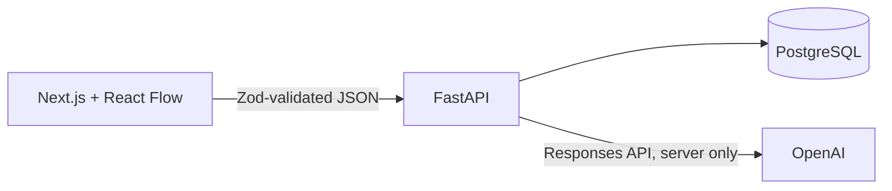

# OpenCanvas AI first-MVP architecture

This document is the implementation boundary for the first production-ready MVP. The broader `ARCHITECTURE.md` describes later evolution; this milestone intentionally ships only text notes, AI response nodes, directional edges, persistence, and contextual AI.

## Runtime shape

- React Flow owns viewport interaction; the API snapshot is canonical durable state.
- Zod validates untrusted data before it enters the TypeScript UI store; Pydantic validates every server request and response.
- FastAPI owns all OpenAI calls. `OPENAI_API_KEY` is never a `NEXT_PUBLIC_*` value.
- `OPENCANVAS_AI_PROVIDER=auto` uses OpenAI when a key exists and returns deterministic contextual answers from the mock provider when it does not. `mock` and `openai` can be selected explicitly for testing and deployment policy.

## Persisted entities

- **Canvas:** name, viewport, monotonic revision, timestamps.
- **Node:** canvas, `note | ai_response`, title, text, position, size, revision, timestamps.
- **Edge:** canvas, source, target, optional label, revision, timestamps.
- **AIRequest:** canvas, instruction, selected-node snapshot/context, provider/model/status/error, timestamps.
- **AIResponse:** request, response node, content, provider response ID, timestamps.

Composite foreign keys prevent edges from crossing canvases, and a check constraint prevents self-edges. Node/edge updates use optimistic revisions to reject stale writes.

## Save and restore

The client keeps interaction state locally for responsive drag/edit behavior. It sends debounced node updates and persists geometry on drag/resize completion. `Ctrl/Cmd+S` flushes pending writes. A refresh reloads `GET /canvases/{id}/snapshot`, which returns the canvas, nodes, and edges atomically.

## Contextual AI flow

1. The user selects one or more nodes and enters an instruction.
2. The browser sends only canvas ID, selected node IDs, and the instruction.
3. The server reloads the selected nodes from PostgreSQL; browser-supplied node text is never trusted as canonical context.
4. The server creates an `AIRequest` audit record and calls the configured provider.
5. On success, one transaction creates the `AIResponse`, an editable `ai_response` node, and `generated_from` edges from every selected node.
6. The API returns the inserted node and edges; the client adds them to React Flow without a full reload.
7. On provider failure, the request is marked failed and no partial response node is created.

Canvas text is wrapped as untrusted reference material and separated from the user instruction. This MVP does not execute content or expose provider internals.

## Test boundary

- Pure tests cover Zod schemas, graph/store transitions, context construction, and provider mapping.
- API integration tests use isolated SQLite with PostgreSQL-compatible SQLAlchemy types. A migration test upgrades a fresh SQLite database through the Alembic revision, while container startup upgrades PostgreSQL.
- Browser tests have two modes. The default suite mocks the HTTP boundary for a deterministic create → save → reload → select → ask → answer-node UI workflow. With `E2E_REAL_API=1`, a no-interception variant runs the same product journey against an externally started FastAPI/PostgreSQL stack. API integration tests independently cover persistence, mock-provider success, and provider failure.
- Local container startup applies the Alembic migration to PostgreSQL before the API starts. The migration enables the pgvector extension on PostgreSQL, but this text-only schema does not add vector columns or indexes yet.
