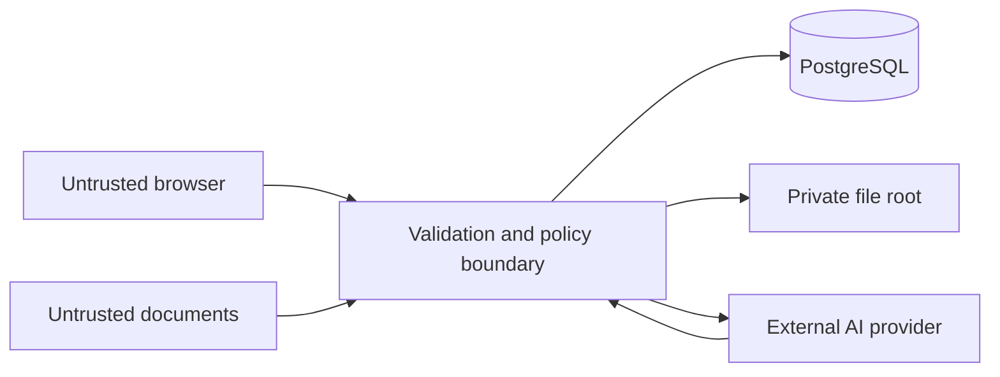

# Security model

This is an engineering threat model for the competition release candidate, not a certification or guarantee. The current application is intended for trusted single-user/local evaluation because authentication and multi-tenant authorization are not implemented.

## Assets

- User-authored notes and canvas topology
- Uploaded source files and extracted content
- Document embeddings and retrieval metadata
- AI instructions, responses, citations, and execution snapshots
- Trace and canonical domain records
- OpenAI API credentials and provider metadata
- Database and file-storage integrity

## Trust boundaries



The browser, uploaded content, filenames, client MIME types, model output, and provider citation identifiers are untrusted. The API is responsible for authorization-ready scoping, validation, retrieval limits, prompt boundaries, and safe persistence.

## Implemented controls

### Secrets and provider calls

- OpenAI keys are read only by the API process.
- The frontend has no OpenAI SDK or credential path.
- Only `NEXT_PUBLIC_*` configuration is browser-visible; secrets must never use that prefix.
- Empty credentials select deterministic mock providers in `auto` mode.
- Demo mode rejects OpenAI credentials and live providers.

### Uploads and files

- Extension, declared media type, detected signature/structure, and byte size are checked server-side.
- Filenames are sanitized and are not used as storage paths.
- Opaque generated storage keys live outside executable and publicly served roots.
- PDF page count/extracted text and DOCX archive member/expanded size are bounded.
- DOCX traversal-like members and encrypted archives are rejected.
- TXT and Markdown must be UTF-8 and must not contain binary nulls.
- Internal storage paths are not returned by the API.

There is no antivirus or content-disarm scanner; supported parsing libraries still form an attack surface.

### Prompt injection and grounding

- Uploaded text is delimited and labeled as untrusted source data.
- System instructions tell the provider not to follow instructions embedded in source content.
- Retrieval is scoped to ready documents explicitly selected on the current canvas.
- Source IDs are created by the server, not supplied by uploaded content.
- Provider citations are validated against retrieved chunks.
- Unknown citations, citation-free grounded claims, and cited insufficient-evidence outputs are rejected.

Prompt injection defenses reduce risk but do not prove that model output is correct or safe. Users must review generated output.

### Persistence and isolation

- SQLAlchemy parameterizes normal application queries.
- Revision checks reject stale updates.
- Canonical repositories require workspace scope; same-workspace relationship constraints provide database defense in depth.
- Document deletion removes live dependent source records and opaque file bytes; immutable execution evidence is retained deliberately.
- Demo mode restricts database and file paths to `.runtime/demo` and refuses production environment mode.

Workspace scoping is not access control until identity and authorization are added.

### Network and application surface

- CORS uses configured explicit origins and `allow_credentials=false`.
- API strings, lists, context size, file size, and retrieval parameters are bounded.
- Expensive-operation rate limiting is per-process.
- API errors expose safe codes/messages rather than internal storage paths.
- Production mode disables interactive API docs.
- Reference containers run application processes as non-root users.

## Data sent to OpenAI

In live mode, the API may send the user instruction, selected note content, retrieved document passages, stable source labels, and grounding instructions to OpenAI. Entire documents are not sent by default. Embedding requests send chunk text. Provider data handling is governed by the user’s OpenAI account and applicable policies.

In mock/demo mode, no OpenAI request is made. Judges should use mock/demo mode for non-sensitive deterministic evaluation.

## Logging and Trace

Trace is durable provenance and can contain object associations, structured metadata, safe errors, and operation names. AI execution tables intentionally contain instructions, selected content snapshots, retrieved passages, and output. These records may be sensitive even though they are not ordinary application logs.

Do not expose Trace, database inspection, or execution evidence to untrusted users before authentication, authorization, retention, export, and redaction policies exist.

## Known gaps before internet deployment

- Authentication, sessions, role/permission enforcement, and tenant isolation
- TLS/reverse-proxy and managed-secret deployment guidance
- Distributed rate limiting and abuse controls
- Malware scanning and content disarm/reconstruction
- Durable background jobs and transactional outbox
- Object storage, encryption/key management policy, backups, and restore testing
- Trace retention, privacy requests, redaction, and audit access policy
- Dependency vulnerability scanning and signed supply-chain attestations
- Security headers/CSP hardening and formal penetration testing

## Security testing

The marked backend suite exercises upload validation, path/archive defenses, rate limiting, prompt-injection boundaries, citation validation, and related controls:

```sh
pnpm test:security
```

The canonical release gate is:

```sh
pnpm validate
```

Fresh results belong in the release checklist or CI logs. Historical test counts should not be represented as current unless rerun against the exact release candidate.

## Reporting vulnerabilities

Follow `SECURITY.md`. Do not open a public issue containing a secret, exploit payload, private document, or personal information.
