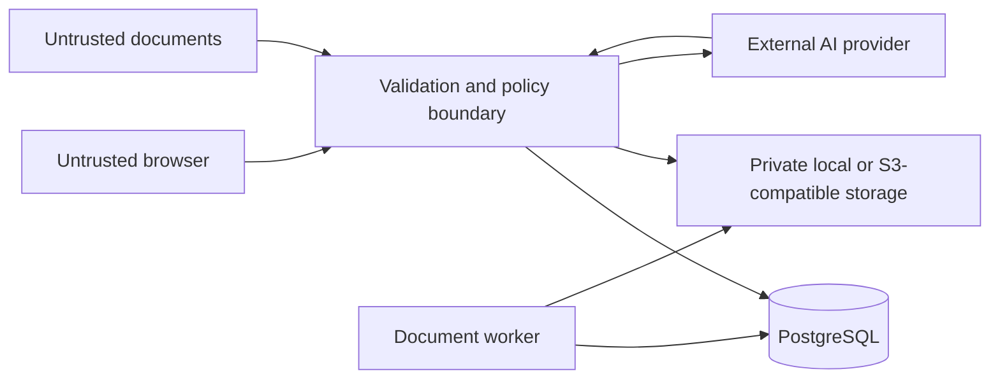

# Security model

This is an engineering threat model for the competition artifact plus the Milestone 3.5
productization bridge, not a certification or guarantee. Individual users authenticate, own
multiple isolated workspaces, and are authorized server-side. Organizations, shared workspaces,
roles, and collaboration are intentionally outside this milestone.

## Assets

- User-authored notes and canvas topology
- Uploaded source files and extracted content
- Document embeddings and retrieval metadata
- AI instructions, responses, citations, and execution snapshots
- Trace and canonical domain records
- User credentials, sessions, password-reset tokens, and account export requests
- OpenAI API credentials and provider metadata
- Database, job queue, worker, and private object-storage integrity

## Trust boundaries



The browser, cookies and CSRF input, uploaded content, filenames, client MIME types, model output,
and provider citation identifiers are untrusted. The API is responsible for authentication,
authorization, workspace scoping, validation, retrieval limits, prompt boundaries, and safe
persistence.

## Implemented controls

### Secrets and provider calls

- OpenAI keys are read only by the API process.
- The frontend has no OpenAI SDK or credential path.
- Only `NEXT_PUBLIC_*` configuration is browser-visible; secrets must never use that prefix.
- Provider selection is explicit; missing live credentials fail configuration or the operation and
  never select deterministic behavior silently.
- Demo mode rejects OpenAI credentials and live providers.

### Uploads and files

- Extension, declared media type, detected signature/structure, and byte size are checked server-side.
- Filenames are sanitized and are not used as storage paths.
- Opaque generated storage keys live outside executable and publicly served roots.
- PDF page count/extracted text and DOCX archive member/expanded size are bounded.
- DOCX traversal-like members and encrypted archives are rejected.
- TXT and Markdown must be UTF-8 and must not contain binary nulls.
- Internal storage paths are not returned by the API.

There is no antivirus or content-disarm scanner; supported parsing libraries still form an attack surface.

### Prompt injection and grounding

- Uploaded text is delimited and labeled as untrusted source data.
- System instructions tell the provider not to follow instructions embedded in source content.
- Retrieval is scoped to ready documents explicitly selected on the current canvas.
- Source IDs are created by the server, not supplied by uploaded content.
- Provider citations are validated against retrieved chunks.
- Unknown citations, citation-free grounded claims, and cited insufficient-evidence outputs are rejected.

Prompt injection defenses reduce risk but do not prove that model output is correct or safe. Users must review generated output.

### Persistence and isolation

- SQLAlchemy parameterizes normal application queries.
- Revision checks reject stale updates.
- Canonical repositories require workspace scope; same-workspace relationship constraints provide database defense in depth.
- Database-backed sessions expire and can be revoked; state-changing browser requests require a
  matching CSRF token.
- Every workspace/canvas, document/file, execution, citation, Trace, and rerun lookup derives or
  verifies ownership server-side and returns a not-found boundary for foreign identifiers.
- Document deletion removes live dependent source records and opaque file bytes; immutable execution evidence is retained deliberately.
- Demo mode restricts database and file paths to `.runtime/demo` and refuses production environment mode.

### Network and application surface

- CORS uses configured explicit origins with credential support; wildcard origins are rejected.
- API strings, lists, context size, file size, and retrieval parameters are bounded.
- Authentication, per-user, per-workspace, and expensive-operation limits are enforced; counters
  remain process-local.
- API errors expose safe codes/messages rather than internal storage paths.
- Production mode disables interactive API docs.
- Reference containers run application processes as non-root users.

## Data sent to OpenAI

In live mode, the API may send the user instruction, selected note content, retrieved document passages, stable source labels, and grounding instructions to OpenAI. Entire documents are not sent by default. Embedding requests send chunk text. Provider data handling is governed by the user’s OpenAI account and applicable policies.

In mock/demo mode, no OpenAI request is made. Judges should use mock/demo mode for non-sensitive deterministic evaluation.

## Controlled-agent planning boundary

Milestone 4.0 adds no active agent behavior. Future controlled agents are an additional untrusted
decision source behind the API policy boundary; model output can propose but cannot authorize an
action. Every future provider or tool attempt must pass a server-side policy enforcement point with
an authenticated user, one owned workspace, an immutable context/plan hash, a narrow expiring
capability grant, current resource-version checks, and explicit approval for durable effects.

External, destructive, privilege-changing, cross-workspace, arbitrary-network, shell, code,
filesystem, raw-database, and credential operations remain prohibited throughout Milestone 4.
Recursive delegation, self-scheduling, ambient execution, and agent-created permissions are also
prohibited. The detailed threat model and phase gates are in
`MILESTONE_4_CONTROLLED_AGENT_ARCHITECTURE.md`.

Milestone 4.1 now defines a side-effect-free, deny-by-default policy contract. Authority must bind
the authenticated user, workspace, execution, closed capability, exact versioned resource, policy
version, immutable plan digest, immutable context digest, and validity window. Revocation records
are append-only. Required approvals additionally bind the grant and exact capability/resource set;
expired, revoked, altered, mismatched, or already-consumed approvals are denied. The evaluator does
not consume approvals itself: a future persistence boundary must record policy decision and
single-use approval consumption atomically before an effect is introduced.

These contracts are deliberately disconnected from routes, providers, tools, workers, schedulers,
and database mutation. They confer no authority merely by existing in client or process memory.
Server authentication, ownership checks, resource-version checks, and persistence constraints
remain mandatory when the contracts are integrated in a later reviewed checkpoint.

## Logging and Trace

Trace is durable provenance and can contain object associations, structured metadata, safe errors, and operation names. AI execution tables intentionally contain instructions, selected content snapshots, retrieved passages, and output. These records may be sensitive even though they are not ordinary application logs.

Trace and execution APIs enforce workspace ownership and redact secrets, authorization headers,
hidden system instructions, internal paths, and unsafe diagnostics. Formal retention, export
artifact generation, redaction workflows, and audit-administrator policy remain deployment work.

## Known gaps before internet deployment

- Organizations, role-based sharing, invitations, and collaboration
- Deployment-specific TLS/reverse-proxy, managed-secret, and key-rotation implementation
- Distributed rate limiting and centralized abuse controls
- Malware scanning and content disarm/reconstruction
- Transactional outbox and broker-backed job administration for larger deployments
- Managed encryption/key policy plus executed backup/restore disaster-recovery drills
- Trace retention, privacy requests, redaction, and audit access policy
- Signed supply-chain attestations
- Formal penetration testing and compliance review

## Security testing

The marked backend suite exercises upload validation, path/archive defenses, rate limiting, prompt-injection boundaries, citation validation, and related controls:

```sh
pnpm test:security
```

The canonical release gate is:

```sh
pnpm validate
```

Fresh results belong in the release checklist or CI logs. Historical test counts should not be represented as current unless rerun against the exact release candidate.

## Reporting vulnerabilities

Follow `SECURITY.md`. Do not open a public issue containing a secret, exploit payload, private document, or personal information.
